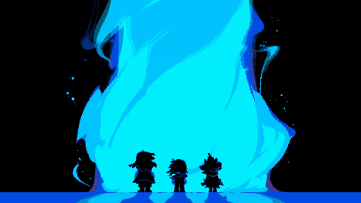

<h1 align="center">👋 Хачапури dev</h1>
<h3 align="center">🎮 Game Dev • 💻 Full-Stack • 🎨 Solo Creator</h3>

  

  

  

- 🔭 Сейчас работаю над **Играми на Unity и десктоп приложениями**

- 🌱 Изучаю **Продвинутые возможности C# и Unity**

- 💬 Открыт к **Сотрудничеству и игровым проектам**

- ⚡ Факт 1: **Хачапури dev (не компания и не бизнес)**

- ⚡ Факт 2: **Мои любимые игры Deltarune и Undertale**

 

<h2 align="center">🛠️ Мой стек технологий</h2>

  
  
  
  
  
  
  
  
  

 

<h2 align="center">📈 Статистика GitHub</h2>

  

 

<h2 align="center">📫 Свяжитесь со мной</h2>

  
  
  
  
  
  
  
  

 
